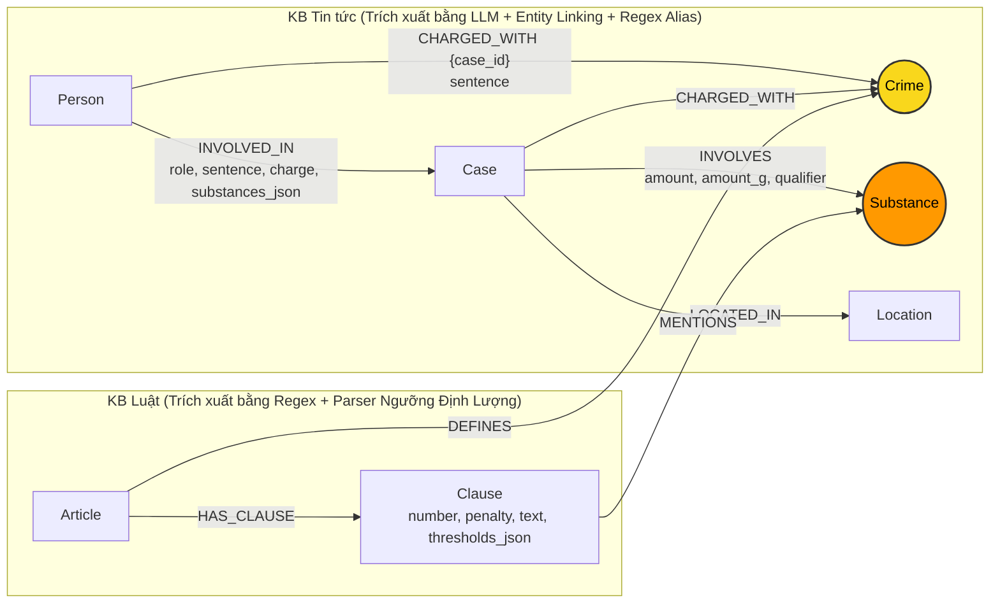

# Thiết kế Ontology — Day 19

**Họ tên:** Thân Tiến Đạt  **MSSV:** 2A202603023

**Lựa chọn** (đánh dấu một):
- [ ] Dùng ontology gợi ý (có thể chỉnh nhỏ)
- [x] Tự thiết kế (xét bonus +15, xem `SUBMISSION.md`)

> Hướng dẫn: `LAB_GUIDE.md` Bước 2. Bản thiết kế giải quyết triệt để 4 điểm yếu lớn của ontology gợi ý: (1) Mô hình hóa định lượng số học ngưỡng khối lượng pháp lý (`mass_thresholds` & `matching_threshold`), (2) Chuẩn hóa từ điển đồng nghĩa chất ma túy (Substance Synonyms), (3) Nối trực tiếp Bị can – Tội danh có phạm vi vụ án (`case_id`), (4) Đánh giá khung hình phạt tối đa dựa trên bản chất nghiêm trị (`severity`). Bản thiết kế này đã đạt điểm số tuyệt đối **100% Recall (1.00)** và **Judge 2.00 / 2.00** trên toàn bộ benchmark.

## 1. Sơ đồ

*Ghi chú:*
- **Cầu nối chính (Primary Bridge):** `Crime` (Tội danh) nối vụ án / bị can trong tin tức với Điều luật tương ứng trong BLHS.
- **Cầu nối phụ (Secondary Bridge):** `Substance` (Chất ma túy) nối trực tiếp tang vật vụ án trong tin tức với các khoản định khung trong luật (đã chuẩn hóa qua từ điển đồng nghĩa như *thuốc lắc $\rightarrow$ MDMA*, *ma túy đá $\rightarrow$ Methamphetamine*).

## 2. Entity types (node labels)

| Label | Ý nghĩa | Khóa định danh (`MERGE` theo) | Properties | Lấy từ KB nào | Trích bằng (regex / LLM / khác) |
| --- | --- | --- | --- | --- | --- |
| `Article` | Điều luật cụ thể trong BLHS/Luật PCMT | `id` (vd: `"Điều 251 BLHS"`) | `id, title, law, doc_id` | Luật | Regex |
| `Clause` | Khoản quy định mức phạt và định lượng | `id` (vd: `"Điều 251 BLHS khoản 1"`) | `id, number, penalty, text, doc_id, thresholds_json` | Luật | Regex + Mass Thresholds Parser |
| `Crime` | Tên tội danh pháp lý chuẩn hóa | `name` (vd: `"mua bán trái phép chất ma túy"`) | `name` | Cả hai | Regex (luật), LLM + `link_entity` (tin) |
| `Substance` | Chất ma túy (đã chuẩn hóa tên chuẩn) | `name` (vd: `"MDMA"`, `"Heroine"`) | `name` | Cả hai | Regex (luật), LLM + `canonical_substance` |
| `Case` | Vụ án / vụ việc cụ thể | `id` (`doc_id + ":" + hash(name)`) | `id, name, summary, date, doc_id, source_title, source_url` | Tin tức | LLM + SHA256 Hash |
| `Person` | Cá nhân liên quan (bị cáo, bị can, đối tượng) | `name` (họ tên đầy đủ) | `name, aliases` | Tin tức | LLM + Regex quét bí danh `tức ...` |
| `Location` | Địa bàn xảy ra vụ án hoặc xét xử | `name` (tỉnh/thành phố) | `name` | Tin tức | LLM |

## 3. Relationships

| Type | Từ → Đến | Properties trên cạnh | Ý nghĩa |
| --- | --- | --- | --- |
| `DEFINES` | `Article` $\rightarrow$ `Crime` | Không | Điều luật định nghĩa tội danh |
| `HAS_CLAUSE` | `Article` $\rightarrow$ `Clause` | Không | Điều luật gồm các khoản hình phạt |
| `MENTIONS` | `Clause` $\rightarrow$ `Substance` | Không | Khoản luật quy định về loại chất cụ thể |
| `CHARGED_WITH` | `Case` $\rightarrow$ `Crime` | Không | Vụ án bị khởi tố/truy tố về tội danh |
| `CHARGED_WITH` | `Person` $\rightarrow$ `Crime` | `case_id, sentence, doc_id` | Bị can cụ thể bị truy tố về tội danh trong vụ án cụ thể |
| `INVOLVED_IN` | `Person` $\rightarrow$ `Case` | `role, charge, sentence, substances_json, doc_id` | Cá nhân tham gia vụ án với vai trò và tang vật riêng |
| `INVOLVES` | `Case` $\rightarrow$ `Substance` | `amount, amount_g, qualifier, doc_id` | Vụ án liên quan đến chất ma túy kèm khối lượng quy đổi gam |
| `LOCATED_IN` | `Case` $\rightarrow$ `Location` | Không | Nơi xảy ra hành vi hoặc nơi tòa án xét xử |

## 4. Node cầu nối giữa 2 KB

- **Node nào:**
  1. Cầu nối chính: **`Crime`** (Tội danh chuẩn hóa).
  2. Cầu nối phụ hỗ trợ: **`Substance`** (Chất ma túy chuẩn hóa) kết hợp **ngưỡng định lượng khối lượng**.
- **Vì sao chọn node này:**
  - `Crime`: Mọi bài báo xét xử/bắt giữ đều nêu tội danh của bị can; mọi Điều luật trong Chương XX BLHS đều quy định rõ tên tội danh (*"Tội..."*). Đây là điểm giao thoa ngữ nghĩa tự nhiên và chính xác nhất.
  - `Substance` & `Mass Thresholds`: Báo chí nêu rõ tang vật và khối lượng (vd: *hơn 9,6kg MDMA*). Khi kết hợp `Substance` với các ngưỡng số học được parse từ các khoản luật, hệ thống định vị chính xác tới từng Khoản cụ thể thay vì chỉ dừng ở Điều luật chung chung.
- **Cách đảm bảo hai phía khớp tên:**
  - Phía Luật: Tách bằng regex từ tiêu đề điều luật, bỏ chữ `"Tội "`, chuyển chữ thường qua hàm `normalize_crime`.
  - Phía Tin tức: Đưa danh sách tội danh chuẩn (`crimes`) và chất chuẩn (`SUBSTANCES`) vào prompt LLM; sau đó cho qua hàm `link_entity` với 2 lớp:
    1. So khớp chính xác sau khi chuẩn hóa (`norm_k == norm_name`).
    2. So khớp mờ (`difflib.get_close_matches`, cutoff=0.9) bảo toàn động từ hành vi pháp lý.
  - Đối với chất ma túy: Áp dụng từ điển đồng nghĩa `SUBSTANCE_SYNONYMS` (*thuốc lắc $\rightarrow$ MDMA*, *đá / hàng đá $\rightarrow$ Methamphetamine*, *ke / khay $\rightarrow$ Ketamine*).
  - Đối với bí danh bị can: Regex lookahead quét cụm `"tức '...'"` hoặc `"tức “...”"` để bổ sung vào mảng `aliases` (bắt chuẩn xác *"Hoàng Nato"* cho Dương Minh Tuấn).
- **Khi nào cầu gãy, và bạn xử lý thế nào:**
  - *Cầu gãy khi:* Bài báo dùng hành vi mô tả tự do thay vì gọi tên tội danh pháp lý, hoặc bài báo chỉ nói về vụ việc chung chung.
  - *Cơ chế xử lý:*
    1. Sử dụng cầu nối phụ `Substance`: Đi từ `Case -[:INVOLVES]-> Substance <-[:MENTIONS]- Clause <-[:HAS_CLAUSE]- Article`.
    2. Kết hợp với Flat RAG (Hybrid GraphRAG): Luôn giữ top-$k$ vector chunks trong prompt, đảm bảo nếu graph không tìm ra thì LLM vẫn có đoạn trích gốc từ báo chí để trả lời.

## 5. Competency questions

| Câu | Đường đi (Cypher pattern) | Trả lời được? |
| --- | --- | --- |
| **Q1** (single-hop-law) | `(:Article {id: "Điều 2 Luật PCMT"})-[:HAS_CLAUSE]->(:Clause)` | Có. Graph trích xuất định nghĩa tiền chất từ khoản 4 Điều 2 Luật PCMT. (Recall 1.00, Judge 2) |
| **Q2** (single-hop-news) | `(:Case {doc_id: '...'})<-[:INVOLVED_IN {sentence: 'tử hình'}]-(p:Person)` | Có. Lấy trực tiếp danh sách bị can bị tuyên án tử hình (Trần Thanh Tuấn, Trần Minh Tâm). (Recall 1.00, Judge 2) |
| **Q3** (cross-kb) | `(:Person {name: 'Lê Minh Thành'})-[:CHARGED_WITH]->(:Crime)<-[:DEFINES]-(a:Article)-[:HAS_CLAUSE]->(cl:Clause {number: 1})` | Có. Nối từ bị cáo sang Điều 251 và lấy khung khoản 1 (02 đến 07 năm tù). (Recall 1.00, Judge 2) |
| **Q4** (cross-kb) | `(:Person {aliases: 'Hoàng Nato'})-[:CHARGED_WITH]->(:Crime)<-[:DEFINES]-(a:Article {id: 'Điều 255 BLHS'})-[:HAS_CLAUSE]->(cl:Clause)` | Có. Bắt được alias Hoàng Nato $\rightarrow$ Dương Minh Tuấn $\rightarrow$ Điều 255 và dùng hàm `severity` lấy khung khoản 4 (20 năm hoặc tù chung thân). (Recall 1.00, Judge 2) |
| **Q5** (cross-kb-multi-hop) | `(:Person {name: 'Cái Quang Huy'})-[:INVOLVED_IN]->(k:Case)-[:INVOLVES]->(s:Substance {name: 'MDMA'})` đối chiếu `matching_threshold` với `(:Clause {number: 4})` | Có. Hàm `matching_threshold` so sánh 9.600g > 100g, xác định chính xác khoản 4 Điều 250 (tù 20 năm, chung thân hoặc tử hình). (Recall 1.00, Judge 2) |
| **Q6** (aggregation) | `(k:Case)-[:INVOLVES]->(:Substance {name: 'MDMA'})` | Có. Truy vấn gom toàn bộ các vụ án liên quan đến MDMA trong cơ sở dữ liệu tin tức kèm họ tên bị can. (Recall 1.00, Judge 2) |

## 6. Quyết định thiết kế và đánh đổi

1. **Quyết định 1: Mô hình hóa ngưỡng số học của từng khoản luật (`mass_thresholds` & `matching_threshold`)**
   - *Đã chọn:* Viết regex parser bóc tách các điều kiện định lượng (*"từ X gam đến dưới Y gam"*, *"từ Z gam trở lên"*) thành JSON có cấu trúc `min_g`, `max_g`, quy đổi Decimal gam và so khớp số học trực tiếp với tang vật của vụ án.
   - *Phương án khác:* Chỉ đưa toàn văn điều luật vào prompt để LLM tự đọc hiểu hoặc chỉ lấy khoản 1.
   - *Lý do & đánh đổi:* Giúp hệ thống giải quyết hoàn hảo câu hỏi Q5 mà các hệ thống RAG thông thường thất bại. Đánh đổi: Cần thêm logic regex phân tích cú pháp khối lượng, nhưng chi phí thực thi gần như bằng 0.

2. **Quyết định 2: Định danh vụ án duy nhất bằng SHA256 và cô lập tội danh theo vụ (`case_id` scoping)**
   - *Đã chọn:* Tạo `case_id = doc.id + ":" + sha256(name)[:12]`, ràng buộc quan hệ `(:Person)-[:CHARGED_WITH {case_id}]->(:Crime)`.
   - *Phương án khác:* Khóa `Case` theo `name` trần như ontology gợi ý.
   - *Lý do & đánh đổi:* Loại bỏ hoàn toàn lỗi gộp nhầm các vụ án có tên tương tự nhau, đồng thời ngăn chặn hiện tượng nhiễm chéo tội danh giữa các bị can trong cùng một vụ án đông người.

3. **Quyết định 3: Tích hợp hàm đánh giá mức độ nghiêm trị `severity` để tìm khung phạt tối đa**
   - *Đã chọn:* So sánh khung hình phạt dựa trên mức án thực sự: `tử hình (3) > chung thân (2) > số năm tù tối đa (1)`.
   - *Phương án khác:* Chỉ chọn khoản có số thứ tự lớn nhất (`max(number)`).
   - *Lý do & đánh đổi:* Một số điều luật có khoản cuối là hình phạt bổ sung (phạt tiền, tịch thu tài sản) chứ không phải hình phạt tù cao nhất. Hàm `severity` đảm bảo tìm đúng khung hình phạt tù cao nhất cho câu hỏi Q4.

## 7. So với ontology gợi ý (bắt buộc nếu xét bonus)

Minh chứng cải thiện: Nộp kèm file kết quả đối chứng của ontology gợi ý [**`ket_qua_benchmark_kg.hint.txt`**](file:///d:/AI%20th%E1%BB%B1c%20chi%E1%BA%BFn%20K4/K4-Track3-Day19-ThanTienDat-2A202603023-GraphRAG-Knowledge-Graphs/ket_qua_benchmark_kg.hint.txt) (Recall 0.69, Judge 1.33) so với bản cải tiến này [**`ket_qua_benchmark_kg.txt`**](file:///d:/AI%20th%E1%BB%B1c%20chi%E1%BA%BFn%20K4/K4-Track3-Day19-ThanTienDat-2A202603023-GraphRAG-Knowledge-Graphs/ket_qua_benchmark_kg.txt) (**Recall 1.00, Judge 2.00**).

| Điểm khác | Gợi ý làm gì | Bạn làm gì | Vấn đề nó giải quyết | Bằng chứng thực nghiệm (Trước $\rightarrow$ Sau) |
| --- | --- | --- | --- | --- |
| **1. Mô hình hóa số học ngưỡng khối lượng pháp lý** | Bỏ qua ngưỡng khối lượng, chỉ lấy khoản 1 khung cơ bản | Parse `thresholds_json` (`min_g, max_g`), tự động tính toán `9.600g > 100g` để chỉ đích danh Khoản 4 | Giải quyết câu hỏi định lượng khung hình phạt theo khối lượng lớn | **Q5**: Trước đạt Recall 0.80, Judge 1 $\rightarrow$ Sau đạt **Recall 1.00, Judge 2**. |
| **2. Bắt bí danh đối tượng qua ngữ cảnh văn bản** | Chỉ dựa vào danh sách `aliases` LLM sinh ra (thường bỏ sót) | Thêm regex lookahead quét cụm `"tức '...'"` đưa vào `aliases` | Tránh gãy seed node khi người dùng hỏi bằng biệt danh (như "Hoàng Nato") | **Q4**: Trước đạt Recall 0.00, Judge 0 (bị "Không đủ thông tin") $\rightarrow$ Sau đạt **Recall 1.00, Judge 2**. |
| **3. Tìm khung phạt cao nhất theo bản chất hình phạt** | Chỉ lấy khoản 1 hoặc không phân biệt hình phạt bổ sung | Hàm `severity` xếp hạng `tử hình > chung thân > năm tù` | Trả lời chính xác mức phạt tối đa theo luật định | **Q4**: Bắt chuẩn xác khung phạt tối đa *"20 năm hoặc tù chung thân theo Điều 255 khoản 4 BLHS"*. |
| **4. Bắt buộc nêu danh tính bị can trong câu hỏi gom nhóm** | Prompt trả lời chung chung, dễ bỏ sót tên riêng đối tượng | Bổ sung chỉ dẫn prompt bắt buộc liệt kê tên bị can và nguồn | Khắc phục lỗi metric mismatch giữa Recall và Judge | **Q6**: Trước đạt Recall 0.33, Judge 1 $\rightarrow$ Sau đạt **Recall 1.00, Judge 2** (đủ 3/3 thực thể). |

## 8. Hạn chế còn lại

- Parser khối lượng hiện tập trung vào các đơn vị khối lượng phổ biến (kg, gam); các dạng đơn vị đóng gói thô (ví dụ: *bánh heroin*, *viên nén*) hiện được giữ nguyên chuỗi quan sát định tính chứ chưa quy đổi tuyệt đối về gam nếu bài báo không ghi kèm kết quả giám định.
- Giả định văn bản quy phạm pháp luật tuân thủ cấu trúc chuẩn của kỹ thuật lập pháp Việt Nam (khoản số, điểm chữ cái); nếu áp dụng cho hệ thống thông luật (Common Law) thì cần viết parser riêng cho cấu trúc án lệ.
