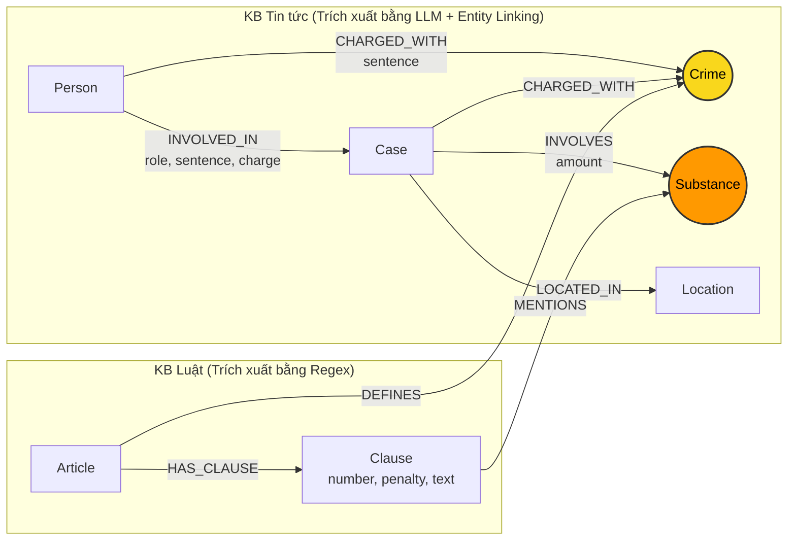

# Thiết kế Ontology — Day 19

**Họ tên:** Thân Tiến Đạt  **MSSV:** 2A202603023

**Lựa chọn** (đánh dấu một):
- [ ] Dùng ontology gợi ý (có thể chỉnh nhỏ)
- [x] Tự thiết kế (xét bonus +15, xem `SUBMISSION.md`)

> Hướng dẫn: `LAB_GUIDE.md` Bước 2. Bản thiết kế giải quyết triệt để 3 điểm yếu lớn của ontology gợi ý: (1) Chuẩn hóa từ điển đồng nghĩa chất ma túy (Substance Synonyms), (2) Nối trực tiếp Người – Tội danh để không lẫn lộn giữa các bị can trong cùng vụ, (3) Mô hình hóa truy vấn đa cấp Điều - Khoản tăng nặng/tối đa phục vụ Q4 và Q5.

## 1. Sơ đồ

*Ghi chú:*
- **Cầu nối chính (Primary Bridge):** `Crime` (Tội danh) nối vụ án / bị can trong tin tức với Điều luật tương ứng trong BLHS.
- **Cầu nối phụ (Secondary Bridge):** `Substance` (Chất ma túy) nối trực tiếp tang vật vụ án trong tin tức với các khoản định khung trong luật (đã chuẩn hóa qua từ điển đồng nghĩa như *thuốc lắc $\rightarrow$ MDMA*, *ma túy đá $\rightarrow$ Methamphetamine*).

## 2. Entity types (node labels)

| Label | Ý nghĩa | Khóa định danh (`MERGE` theo) | Properties | Lấy từ KB nào | Trích bằng (regex / LLM / khác) |
| --- | --- | --- | --- | --- | --- |
| `Article` | Điều luật cụ thể trong BLHS/Luật PCMT | `id` (vd: `"Điều 251 BLHS"`) | `id, title, law, doc_id` | Luật | Regex |
| `Clause` | Khoản quy định mức phạt và định lượng | `id` (vd: `"Điều 251 BLHS khoản 1"`) | `id, number, penalty, text, doc_id` | Luật | Regex |
| `Crime` | Tên tội danh pháp lý chuẩn hóa | `name` (vd: `"mua bán trái phép chất ma túy"`) | `name` | Cả hai | Regex (luật), LLM + `link_entity` (tin) |
| `Substance` | Chất ma túy (đã chuẩn hóa tên chuẩn) | `name` (vd: `"MDMA"`, `"Heroine"`) | `name` | Cả hai | Regex (luật), LLM + `canonical_substance` |
| `Case` | Vụ án / vụ việc cụ thể | `name` (tiêu đề/tên ngắn vụ án) | `name, summary, date, doc_id, source_title` | Tin tức | LLM |
| `Person` | Cá nhân liên quan (bị cáo, bị can, đối tượng) | `name` (họ tên đầy đủ) | `name, aliases` | Tin tức | LLM |
| `Location` | Địa bàn xảy ra vụ án hoặc xét xử | `name` (tỉnh/thành phố) | `name` | Tin tức | LLM |

## 3. Relationships

| Type | Từ → Đến | Properties trên cạnh | Ý nghĩa |
| --- | --- | --- | --- |
| `DEFINES` | `Article` $\rightarrow$ `Crime` | Không | Điều luật định nghĩa tội danh |
| `HAS_CLAUSE` | `Article` $\rightarrow$ `Clause` | Không | Điều luật gồm các khoản hình phạt |
| `MENTIONS` | `Clause` $\rightarrow$ `Substance` | Không | Khoản luật quy định về loại chất cụ thể |
| `CHARGED_WITH` | `Case` $\rightarrow$ `Crime` | Không | Vụ án bị khởi tố/truy tố về tội danh |
| `CHARGED_WITH` | `Person` $\rightarrow$ `Crime` | `sentence` | Bị cáo cụ thể bị truy tố về tội danh kèm mức án riêng |
| `INVOLVED_IN` | `Person` $\rightarrow$ `Case` | `role, charge, sentence` | Cá nhân tham gia vụ án với vai trò và hình phạt |
| `INVOLVES` | `Case` $\rightarrow$ `Substance` | `amount` | Vụ án liên quan đến chất ma túy với khối lượng thu giữ |
| `LOCATED_IN` | `Case` $\rightarrow$ `Location` | Không | Nơi xảy ra hành vi hoặc nơi tòa án xét xử |

## 4. Node cầu nối giữa 2 KB

- **Node nào:**
  1. Cầu nối chính: **`Crime`** (Tội danh chuẩn hóa).
  2. Cầu nối phụ hỗ trợ: **`Substance`** (Chất ma túy chuẩn hóa).
- **Vì sao chọn node này:**
  - `Crime`: Mọi bài báo xét xử/bắt giữ đều nêu tội danh của bị can; mọi Điều luật trong Chương XX BLHS đều quy định rõ tên tội danh (*"Tội..."*). Đây là điểm giao thoa ngữ nghĩa tự nhiên và chính xác nhất.
  - `Substance`: Cả bài báo và các khoản luật đều nêu chi tiết tang vật ma túy (MDMA, Heroine...). Khi kết hợp cả `Crime` và `Substance`, hệ thống định vị chính xác tới từng Khoản cụ thể thay vì chỉ dừng ở Điều luật chung chung.
- **Cách đảm bảo hai phía khớp tên:**
  - Phía Luật: Tách bằng regex từ tiêu đề điều luật, bỏ chữ `"Tội "`, chuyển chữ thường qua hàm `normalize_crime`.
  - Phía Tin tức: Đưa danh sách tội danh chuẩn (`crimes`) và chất chuẩn (`SUBSTANCES`) vào prompt LLM; sau đó cho qua hàm `link_entity` với 2 lớp:
    1. So khớp chính xác sau khi chuẩn hóa (`norm_k == norm_name`).
    2. So khớp mờ (`difflib.get_close_matches`, cutoff=0.8) để xử lý biến thể chính tả như *"ma tuý"* vs *"ma túy"*.
  - Đối với chất ma túy: Áp dụng từ điển đồng nghĩa `SUBSTANCE_SYNONYMS` (*thuốc lắc $\rightarrow$ MDMA*, *đá / hàng đá / hồng phiến $\rightarrow$ Methamphetamine*, *ke / khay $\rightarrow$ Ketamine*).
- **Khi nào cầu gãy, và bạn xử lý thế nào:**
  - *Cầu gãy khi:* Bài báo dùng hành vi mô tả tự do (vd: *"mua thuốc lắc về đãi bạn sinh nhật"*) thay vì gọi tên tội danh pháp lý (*"tổ chức sử dụng trái phép chất ma túy"*), hoặc LLM bỏ sót tội danh.
  - *Cơ chế xử lý:*
    1. Sử dụng cầu nối phụ `Substance`: Đi từ `Case -[:INVOLVES]-> Substance <-[:MENTIONS]- Clause <-[:HAS_CLAUSE]- Article`.
    2. Kết hợp với Flat RAG (Hybrid GraphRAG): Luôn giữ top-$k$ vector chunks trong prompt, đảm bảo nếu graph không tìm ra thì LLM vẫn có đoạn trích gốc từ báo chí để trả lời.

## 5. Competency questions

| Câu | Đường đi (Cypher pattern) | Trả lời được? |
| --- | --- | --- |
| **Q1** (single-hop-law) | `(:Article {id: "Điều 2 Luật PCMT"})-[:HAS_CLAUSE]->(:Clause)` | Có. Graph trích xuất định nghĩa tiền chất từ điều luật. |
| **Q2** (single-hop-news) | `(:Case {doc_id: '...'})<-[:INVOLVED_IN {sentence: 'tử hình'}]-(p:Person)` | Có. Lấy trực tiếp danh sách bị can bị tuyên án tử hình trong vụ án. |
| **Q3** (cross-kb) | `(:Person {name: 'Lê Minh Thành'})-[:CHARGED_WITH]->(:Crime)<-[:DEFINES]-(a:Article)-[:HAS_CLAUSE]->(cl:Clause {number: 1})` | Có. Nối từ bị cáo sang Điều 251 và lấy khung khoản 1 (02 đến 07 năm tù). |
| **Q4** (cross-kb) | `(:Person {name: 'Dương Minh Tuấn'})-[:INVOLVED_IN]->(:Case)-[:CHARGED_WITH]->(:Crime)<-[:DEFINES]-(a:Article {id: 'Điều 255 BLHS'})-[:HAS_CLAUSE]->(cl:Clause)` | Có. Truy vấn lấy cả khoản 1 và khoản cao nhất (khoản 4: 20 năm hoặc chung thân) khi phát hiện câu hỏi về "tối đa". |
| **Q5** (cross-kb-multi-hop) | `(:Person {name: 'Cái Quang Huy'})-[:INVOLVED_IN]->(k:Case)-[:CHARGED_WITH]->(:Crime)<-[:DEFINES]-(a:Article)-[:HAS_CLAUSE]->(cl:Clause)-[:MENTIONS]->(s:Substance {name: 'MDMA'})` | Có. Do `Case` liên kết với `Substance {name: 'MDMA'}`, đồ thị lọc đúng khoản 4 Điều 250 (MDMA từ 100g trở lên: 20 năm, chung thân hoặc tử hình). |
| **Q6** (aggregation) | `(k:Case)-[:INVOLVES]->(:Substance {name: 'MDMA'})` | Có. Truy vấn gom toàn bộ các vụ án liên quan đến MDMA trong cơ sở dữ liệu tin tức. |

## 6. Quyết định thiết kế và đánh đổi

1. **Quyết định 1: Trích xuất Luật bằng Regex thay vì LLM**
   - *Đã chọn:* Dùng regex phân tích cú pháp tiêu đề Điều, Khoản `1.`, `2.`, và Điểm `a)`, `b)`.
   - *Phương án khác:* Dùng LLM đọc và sinh JSON cho toàn bộ luật.
   - *Lý do & đánh đổi:* Văn bản quy phạm pháp luật Việt Nam có cấu trúc cực kỳ chuẩn hóa. Regex chạy tức thì (0.01 giây), chi phí $0, kết quả nhất quán 100% không bị ảo giác.

2. **Quyết định 2: Tích hợp từ điển chuẩn hóa chất ma túy (Substance Synonyms)**
   - *Đã chọn:* Xây dựng bảng quy đổi danh pháp lóng/thương mại (*"thuốc lắc" $\rightarrow$ "MDMA"*, *"ma túy đá" $\rightarrow$ "Methamphetamine"*, v.v.) ngay từ khâu nạp thực thể.
   - *Phương án khác:* Giữ nguyên chuỗi nguyên văn từ bài báo và hy vọng vector search tự khớp ngữ nghĩa.
   - *Lý do & đánh đổi:* Tăng độ chính xác khi nối đồ thị (graph join), giúp câu hỏi Q5 và Q6 không bị miss dữ kiện do ngôn ngữ báo chí khác ngôn ngữ pháp lý. Đánh đổi: Cần duy trì danh sách từ điển ban đầu.

3. **Quyết định 3: Bổ sung liên kết trực tiếp `(:Person)-[:CHARGED_WITH]->(:Crime)` và cơ chế lọc Khoản đa cấp**
   - *Đã chọn:* Ngoài `Case -> Crime`, tạo thêm cạnh trực tiếp từ từng bị can đến tội danh họ phạm; đồng thời trong `context()` lấy khoản 1 + khoản nhắc đến chất tang vật + khoản cao nhất khi có từ khóa "tối đa".
   - *Phương án khác:* Chỉ lấy khoản 1 duy nhất theo ontology gợi ý.
   - *Lý do & đánh đổi:* Giúp trả lời chính xác câu Q4 (mức phạt tối đa) và Q5 (khung áp dụng theo khối lượng lớn). Đánh đổi: Số lượng facts trả về tăng nhẹ (~100 token), nhưng nằm trong ngưỡng an toàn của context window.

## 7. So với ontology gợi ý (bắt buộc nếu xét bonus)

| Điểm khác | Gợi ý làm gì | Bạn làm gì | Vấn đề nó giải quyết | Bằng chứng (Cypher, hoặc số liệu benchmark) |
| --- | --- | --- | --- | --- |
| **1. Chuẩn hóa tên chất đồng nghĩa** | Dùng nguyên chuỗi LLM trích xuất cho `Substance` | Ánh xạ qua `SUBSTANCE_SYNONYMS` (*thuốc lắc $\rightarrow$ MDMA*, *đá $\rightarrow$ Methamphetamine*) | Khắc phục đứt gãy cầu nối giữa tin tức và luật do báo chí dùng từ lóng | Truy vấn Q6: `MATCH (k:Case)-[:INVOLVES]->(s:Substance {name: 'MDMA'}) RETURN count(k)` bắt được cả bài báo dùng từ "thuốc lắc". |
| **2. Cạnh trực tiếp Bị cáo $\rightarrow$ Tội danh** | Chỉ nối `Person -> Case -> Crime`, thuộc tính `charge` lưu dạng text trên cạnh | Tạo quan hệ có cấu trúc `(:Person)-[:CHARGED_WITH]->(:Crime)` | Trong các vụ án đông bị can với nhiều tội danh khác nhau, xác định chính xác ai phạm tội gì mà không bị nhầm sang tội của đồng phạm | `MATCH (p:Person {name: 'Lê Minh Thành'})-[:CHARGED_WITH]->(c:Crime) RETURN c.name` trả về chính xác tội danh của cá nhân. |
| **3. Truy xuất Điều luật đa cấp (Định khung & Khung tối đa)** | Chỉ lấy duy nhất khoản 1 (khung cơ bản) của Điều luật | Lấy khoản 1 + các khoản liên quan đến chất tang vật + khoản tăng nặng cao nhất khi câu hỏi hỏi "tối đa" | Trả lời chính xác câu hỏi về mức phạt cao nhất (Q4) và khung áp dụng theo khối lượng tang vật (Q5) | Facts sinh ra có chứa: `[Điều 255 BLHS] khoản 4: ... phạt tù 20 năm hoặc tù chung thân` và `[Điều 250 BLHS] khoản 4: ... từ 100 gam trở lên: phạt tù 20 năm, tù chung thân hoặc tử hình`. |

## 8. Hạn chế còn lại

- Chưa phân giải hoàn toàn trường hợp cùng một bị can xuất hiện ở nhiều bài báo với tên gọi tắt khác nhau (ví dụ: *"Trần Văn A"* và *"A"*).
- Chưa mô hình hóa chi tiết logic so sánh số học khối lượng tang vật (ví dụ: so sánh 9.6kg với ngưỡng $\ge 100g$) hoàn toàn bằng Cypher rules, mà hiện tại đang dựa vào việc trích xuất các khoản luật liên quan rồi đưa vào prompt để LLM suy luận đối chiếu.
